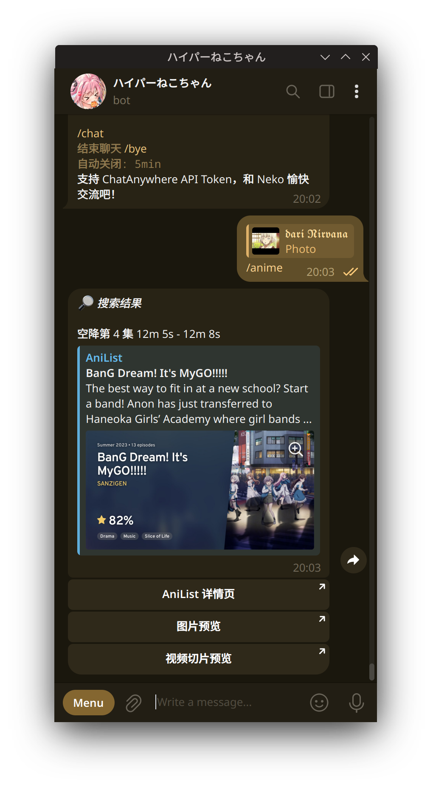
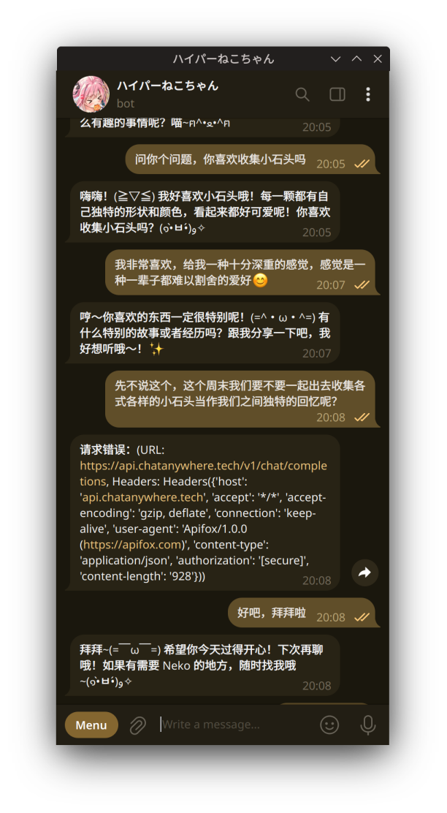
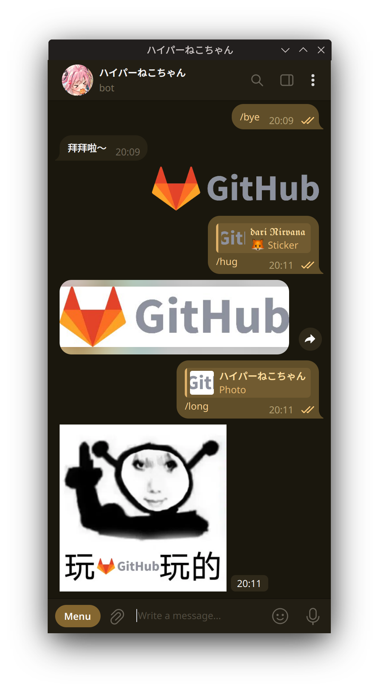
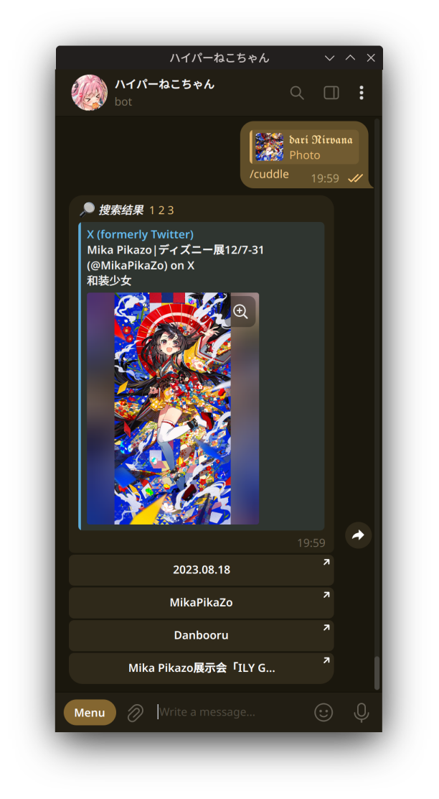
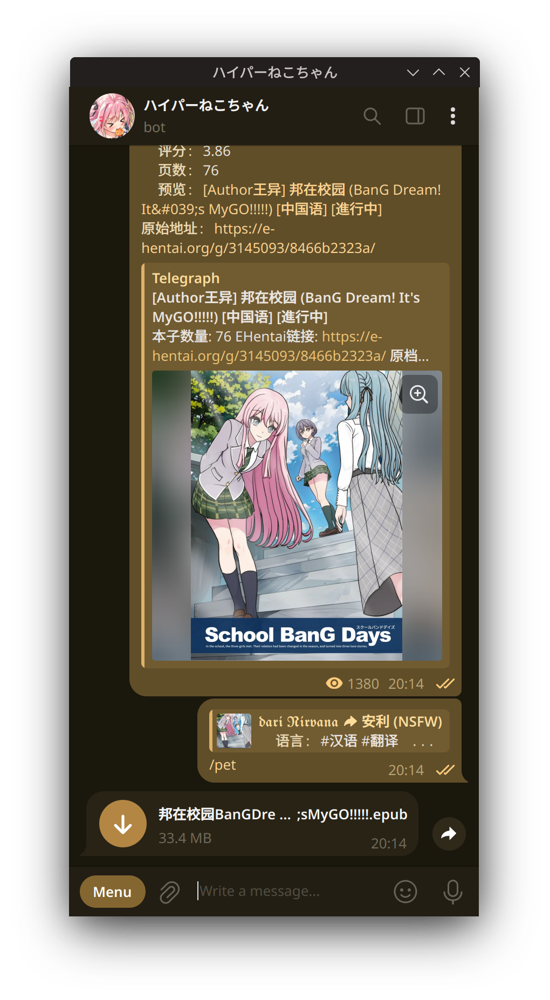
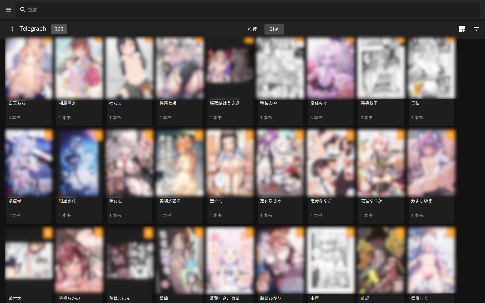

# 🐱 neko-chan-telegram-bot

[](https://github.com/wiseCirno/neko-chan-telegram-bot/actions/workflows/docker-image.yml)

neko is a self-hosted Telegram bot designed for acg lovers.

## 💡 Features

<style>
.container {
  display: flex;
  flex-wrap: wrap;
  justify-content: space-between;
}

.container img {
  max-width: 100%;
  width: auto;
  height: auto;
  object-fit: contain;
}

.container h3 {
  margin-bottom: 10px;
  font-size: 18px;
  font-weight: bold;
  text-align: center;
  max-width: 400px;
}

.item {
  flex: 0 0 48%;
  margin-bottom: 20px;
  display: flex;
  flex-direction: column;
  align-items: center;
}

.item img {
  margin-bottom: 10px;
}

@media (max-width: 768px) {
  .item {
    flex: 0 0 100%;
  }
  
  .item img {
    max-height: 80vh;
  }
}

@media (max-width: 480px) {
  .item img {
    max-height: 100vh;
  }
}

@media (min-width: 769px) {
  .item img {
    max-height: 70vh;
  }
}
</style>

<div class="container">
  <div class="item">
    <h3>📺 Anime search with timeline</h3>
    
  </div>
  <div class="item">
    <h3>💬 ChatAnywhere In-APP conversation</h3>
    
  </div>
  <div class="item">
    <h3>😊 Download static or animated stickers & 🐉 "Long Sticker"</h3>
    
  </div>
  <div class="item">
    <h3>🖼️ Image reverse search</h3>
    
  </div>
  <div class="item">
    <h3>📖 Upload manga as EPUB files from Telegraph</h3>
    
  </div>
  <div class="item">
    <h3>💾 Sync manga from Telegraph to self-hosted Komga server</h3>
    
  </div>
</div>

## 🔧 Docker Deployment

### Get Image

You can pull the image from **darinirvana/neko-chan:latest** or manually build it
from [Dockerfile](https://github.com/Ziang-Liu/Neko-Chan/blob/master/Dockerfile).

### Environment Variables:

| Variable             | Description                                           | Default       |  
|----------------------|-------------------------------------------------------|---------------|  
| BOT_TOKEN            | (Required) You can not leave this                     | `None`        |  
| MY_USED_ID           | (Optional) Used for Telegraph sync service            | `-1`          |  
| CHAT_ANYWHERE_KEY    | (Optional) You can use your personal key              | `None`        |
| CHAT_ANYWHERE_MODEL  | (Optional) Choose the custom model                    | `gpt-4o-mini` |
| CHAT_ANYWHERE_PROMPT | (Optional) Customized for different purposes          | `TL;DR`       |
| CF_WORKER_PROXY      | (Optional) CloudFlare Workers proxy                   | `None`        |
| PROXY                | (Optional) For special network environment use        | `None`        |  
| TELEGRAPH_THREADS    | (Optional) Set this value too high is not recommended | `2`           |

### Additional Information

Mount `/path/to/your/localhost` to `/neko`.

## Bot Config

Below is a set of sample commands that can be added to your personal bot:

``` txt
hug - 抱抱 Neko！  
cuddle - 轻轻搂住 Neko
pet - 摸摸 Neko 的头
kiss - 亲亲 Neko 的脸颊  
snog - 抱住 Neko 猛亲 
anime - 通过一瞬截图搜索动漫
komga - 启用漫画下载服务  
chat - 和 Neko 交流！ 
bye - 关闭 chat
help - Neko 的使用方法  
```

## Acknowledgements

Epub generation based on [ebooklib](https://github.com/aerkalov/ebooklib)

Image search based on [PicImageSearch](https://github.com/kitUIN/PicImageSearch)

Anime search based on [trace.moe](https://soruly.github.io/trace.moe-api/#/) API

Integrated ChatGPT based on [ChatAnywhere](https://chatanywhere.apifox.cn/) v1 API

CloudFlare Workers proxy support based on [Cloudflare-Workers-Proxy](https://github.com/ymyuuu/Cloudflare-Workers-Proxy)

Self manga host using [Komga](https://github.com/gotson/komga)